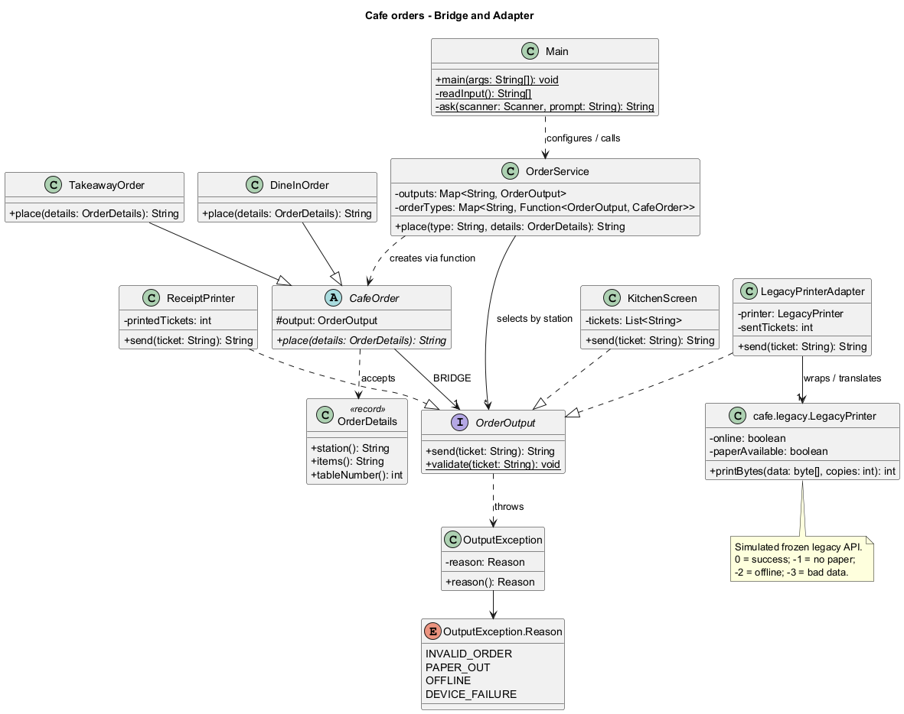

# Cafe orders - Bridge and Adapter

Java 17+ and Maven 3.9+. One application combines order types and output devices.
Required complexity module: **dynamic implementor selection**.

## Build and tests

```powershell
mvn clean verify
```

Compiles the project, runs JUnit 5 tests and produces an executable JAR.
Tests only: `mvn test`. The first build needs internet for dependencies.

## Run

In IntelliJ, open this Maven project and run **cafe.Main** with empty Program arguments.
The console asks for the order type, preparation station, table (dine-in only) and items.
For example: `takeaway`, `bakery`, `Croissant`.

Terminal interactive mode:

```powershell
java -jar target/cafe-orders-1.0.0.jar
```

Optional four-argument mode (type, station, table, items):

```powershell
java -jar target/cafe-orders-1.0.0.jar dine-in kitchen 7 "Burger and tea"
java -jar target/cafe-orders-1.0.0.jar takeaway bar 0 "Coffee"
java -jar target/cafe-orders-1.0.0.jar takeaway bakery 0 "Croissant"
```

Dine-in needs a positive table number. Takeaway uses 0 (no table).
The station selects the output: kitchen -> screen; bar -> modern printer;
bakery -> legacy printer through Adapter. Either order type works with any station.
A ticket includes either table/serving instructions or takeaway packing instructions.
Output devices are console simulations, not real hardware or network services.
Receipt counters and the screen queue last only for the current process.

## Design

| Role | Class |
|---|---|
| Abstraction | CafeOrder |
| Refined Abstractions | DineInOrder, TakeawayOrder |
| Implementor / Target | OrderOutput |
| Native implementors | KitchenScreen, ReceiptPrinter |
| Adapter / third implementor | LegacyPrinterAdapter |
| Adaptee | legacy.LegacyPrinter |
| Runtime routing | OrderService |

The independent legacy API accepts UTF-8 bytes and a copy count, returning integer
statuses. The adapter converts text, requests one copy, translates results and all
operational failures into the common contract. It does not modify the adaptee.

## Submission documents

- [UML](docs/uml.png)
- [Design rationale](docs/design-rationale.md)



## Tests

- CafeOrderTest: recording stubs check formatting, exactly-once delegation and failures.
- LegacyPrinterAdapterTest: UTF-8, copy count, all statuses, exceptions and byte limits.
- OrderServiceTest: runtime selection and independent extension of both axes.
- OutputIntegrationTest: shared contract and all six order/output combinations.
